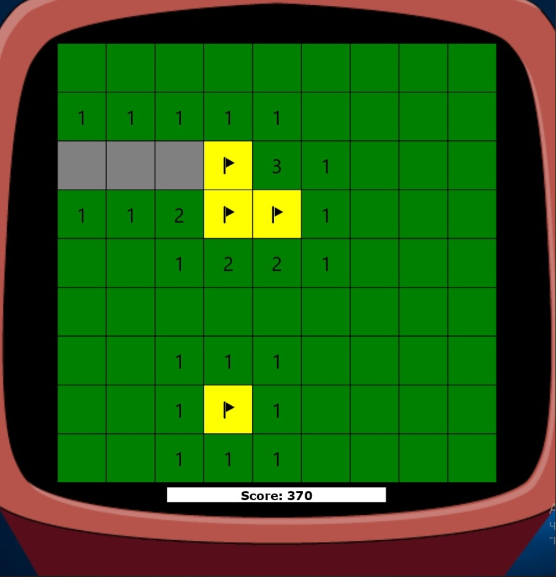
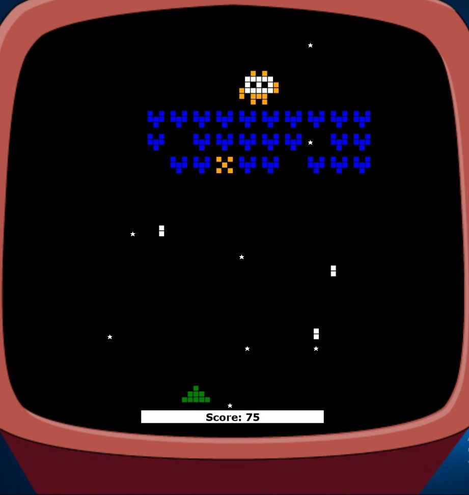

# Классические игры на Java
## Описание
Классические игры на языке программирования Java. Свои силы можно попробовать в одной из предложенных игр:

2048

Краткие правила таковы: у вас есть поле 4х4, разбитое на квадратные плитки. В каждом раунде появляется плитка с номиналом «2» (с вероятностью 90%) или «4» (с вероятностью 10%). Все плитки можно перемещать в одну из четырёх сторон, при этом если две плитки одного номинала «налетают» друг на друга, они слипаются и их номинал удваивается. Цель — получить плитку номиналом 2048. Игрок проигрывает, если после очередного хода невозможно совершить действие.

Сапёр

Итак, у нас есть поле, разделённое на квадраты. Какие-то из них «заминированы», но сколько таковых и где они, мы не в курсе. Наша цель — открыть все незаминированные квадраты и не подорваться. Вы открываете квадрат левой кнопкой мыши, и если под ней мины нет, то появится число, означающее количество мин, расположенных по соседству с открытой ячейкой. Теперь нужно немного посчитать и предположить, какие ячейки можно открывать, а какие следует пометить, как заминированные. И так до победы или подрыва.

Змейка

Длинное змееобразное существо ползает по ограниченному полю, подчиняясь приказам игрока (право, лево, вниз, вверх). И нет никакой возможности остановить его движение. Только бы не коснуться краев поля, иначе гибель! Только бы не укусить себя, иначе… ну вы поняли. На пути у существа попадается еда, от которой оно становится ещё длиннее. От роста ему становиться всё теснее, и теснее, и теснее…

Гонки

Вы управляете машинкой, едете на большой скорости и попутно уворачиваетесь от других машин и разных, порою очень нелогичных, препятствий. Помимо игрока, который умеет рулить вправо и влево, а также ускоряться, будут присутствовать движущиеся по горизонтали и вертикали объекты — другие машины, а также неподвижные препятствия. Цель — добраться до финишной линии, не врезавшись ни в один из этих объектов. Финишная черта появится через какое-то определённое количество препятствий.  

Прилунение

Вам предстоит играть за капитана симпатичного посадочного модуля, который нужно аккуратно посадить на Луну, не задев горы. Для мягкой и ровной посадки будем использовать  основной двигатель, который замедляет падение и приподнимает, а также боковые двигатели для горизонтального перемещения. 

Космические захватчики

Космический сеттинг с симпатичной графикой а-ля 8 бит, стрельба по агрессивным захватчикам, рядовым и «генералам», которые прячутся за их спинами, возможность уворачиваться от вражеских выстрелов, перемещаясь вправо и влево. Игроку предстоит сражаться до тех пор, пока он не убьет всех рядовых и босса. Или пока его не сразит инопланетная пуля. 

Проект основан на движке от [JavaRush](https://javarush.com) и немного переработан под нужды проекта. В движок были добавлены аннотации, пауза в начале игры и возможность выбора игр из общего меню.
#### Стэк: JavaCore, JavaFX

## Запуск
### С помощью командной строки (рекомендовано):
1. Скачать JavaFx по ссылке https://gluonhq.com/products/javafx/ и распаковать
2. Скачать данный репозиторий и распаковать
3. Открыть в текстовом редакторе Games-master\src\sample\StartMe.java
4. Изменить содержимое строки #39 String JAVA_FX_LIB на путь к папке lib в пакете с JavaFx.
Например, C:\User\Desktop\javafx-sdk-18.0.2\lib
5. Запустить командную строку и пройти в корневую папку (Games-master/src)
6. Ввести команды по очереди:

javac --module-path "Путь к папке lib в JavaFx(кавычки оставить)" --add-modules ALL-MODULE-PATH -d out/production/Engine sample/StartMe.java 

java --module-path "Путь к папке lib в JavaFx(кавычки оставить)" --add-modules ALL-MODULE-PATH -classpath out/production/Engine sample.StartMe

### C помощью IDEA:

1. Скачать JavaFx по ссылке https://gluonhq.com/products/javafx/ и распаковать
2. Скачать репозиторий и распаковать
3. Открыть в IDEA Games-master\src\sample\StartMe.java
4. Изменить содержимое строки #39 String JAVA_FX_LIB на путь к папке lib в пакете с JavaFx.
Например, C:\User\Desktop\javafx-sdk-18.0.2\lib
5. В IDEA перейти File->Project Structure->Libraries и удалить lib нажатием "-". Подтвердить - "Aplly"
6. Там же нажатием "+" добавить новую библиотеку. Библиотека находится в папке lib пакета JavaFx. Подтвердить - "Aplly"
Например, C:\User\Desktop\javafx-sdk-18.0.2\lib
7. Запустить StartMe.java (Так и должно быть:Error: JavaFX runtime components are missing, and are required to run this application)
8. В IDEA перейти Run->Edit Configurations->Modify options->Add VM Options. В строке VM options вставить:

--module-path "Путь к папке lib в JavaFx(кавычки оставить)" --add-modules ALL-MODULE-PATH
9. Там же в строке Working Directory проверить указан ли путь до папки src.
Например, C:\User\Desktop\Games-master\src
10. Запустить StartMe.java 
 